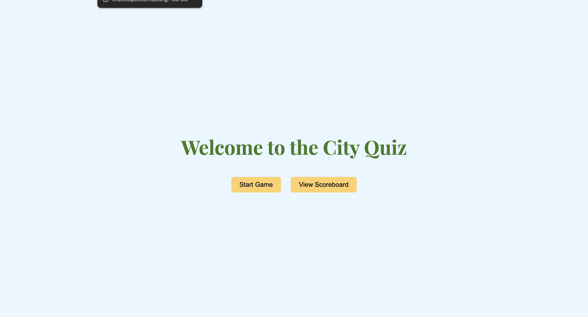
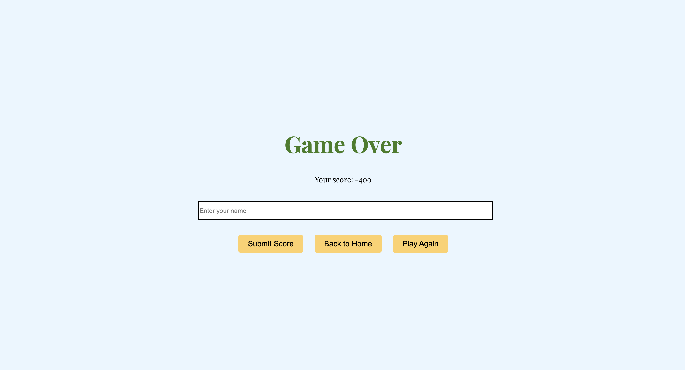
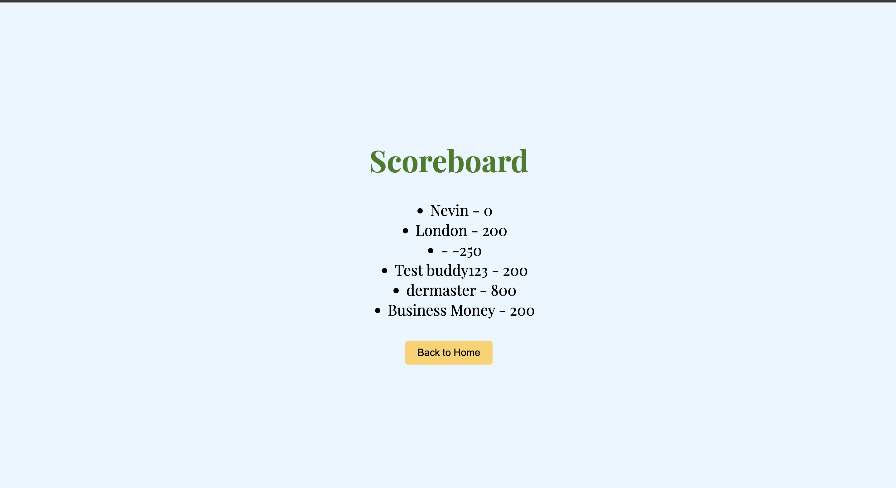
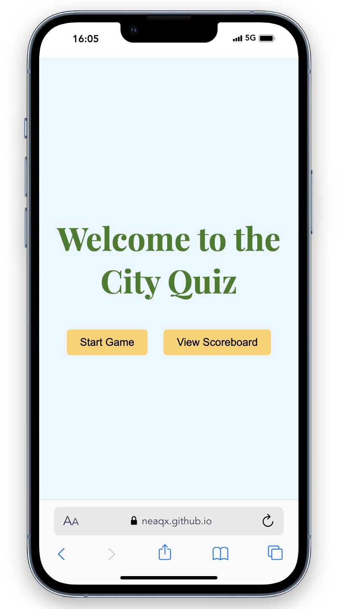
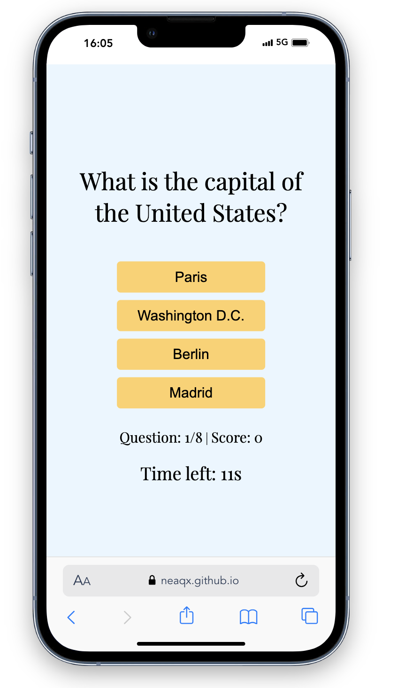
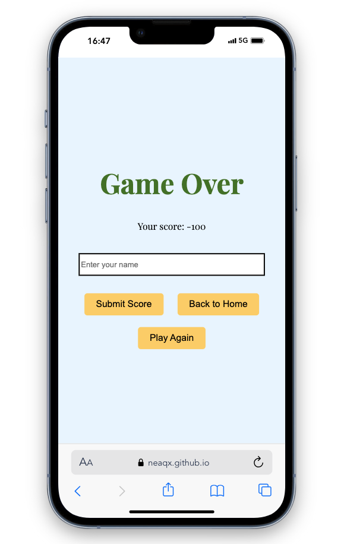
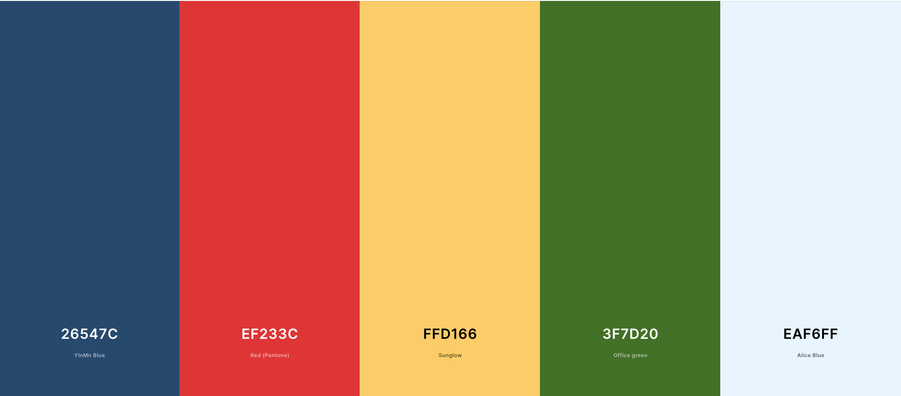
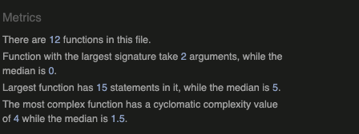

# The City Master

The City Master is an engaging quiz game designed to test players' knowledge of world capitals. Each round presents a question about a capital city, which must be answered within a 15-second time frame. Correct and prompt responses earn points, while incorrect or untimely answers result in point deductions. TheCitymaster combines knowledge and speed, providing an entertaining platform for users to challenge their geographical proficiency while learning in a playful manner.

[View Game Master live project here](https://neaqx.github.io/thecitymaster/)
- - -
## Table of Contents

### [User Experience (UX)](#user-experience-ux-1)
* [User Stories](#user-stories)
### [Features](#features-1)
* [Existing Features](#existing-features)
### [Features Left to Implement](#features-left-to-implement-1)
### [Design](#design-1)
### [Technologies Used](#technologies-used-1)
### [Frameworks, Libraries & Programs Used](#frameworks-libraries--programs-used-1)
### [Testing](#testing-1)
* [JSHint Results](#jshint-results)
* [Manual Testing](#manual-testing)
* [Fixed Bugs](#fixed-bugs)
* [Lighthouse Report](#lighthouse-report)
### [Deployment](#deployment-1)
* [GitHub Pages](#github-pages)
* [Forking the GitHub Repository](#forking-the-github-repository)
* [Local Clone](#local-clone)
### [Credits](#credits-1)
* [Code](#code)
* [Content](#content)
* [Media](#media)
### [Acknowledgements](#acknowledgements-1)
---
## User Experience (UX)

The City Master is an engaging educational quiz game designed to test and enhance players' knowledge of world capitals. In each round, participants are presented with a question about a capital city, which they must answer within a strict 15-second time frame. This time constraint adds an element of urgency and excitement to the gameplay. Correct and prompt responses are rewarded with points, while incorrect or delayed answers result in point deductions, creating a dynamic and competitive environment.

The primary objective of The City Master is to combine learning with entertainment, making it an effective tool for educational purposes. By encouraging quick thinking and reinforcing memory recall, the game helps players improve their geographical knowledge in an enjoyable and interactive manner. Additionally, TheCitymaster offers varying levels of difficulty, catering to a wide range of players from beginners to geography enthusiasts.

### User Stories

* First-time visitor goals
    * Understand the main purpose of the website, that its a quiz game.
    * Starting quiz-game.
    * Taking the quiz with eight.
    * Checking & typing their score in the High Scores inputflied.
    * Enjoying the overall experience.

* Returning visitor goals
    * Improving their score.
    * Exploring new features.
    * Checking high scores.
    * Continuing to enjoy the overall experience.

* Frequent user goals
    * Aim to master the quiz by achieving a perfect score.
    * Competing with other users in their local enviroment.
    * Exploring new features.
    * Continuing to enjoy the overall experience.

---

## Features

* The primary goal of City Master is to create a captivating and interactive space where users can not only test but also enhance their knowledge about cities. This platform is thoughtfully designed to engage users in an immersive learning experience, making the exploration of general knowledge. 
* High Scores table that displays high scores from different play sessions in the local enviroment
* Responsive design that is optimized for different devices, such as desktop computers, tablets, and smartphones.
*The timer gives the user a sense of urgency and excitement, encouraging quick thinking and enhancing the overall gameplay experience.

### Existing Features

* Game page / Interface
    * Start game button, which can be accesed without an username.
    * Scoreboard button which redirect to scores, where the user can see the high scores.
    * Quiz questions are in the middle of the page.
    * The progress counter is below the question and answers
    * The timer below the progress counter.

* Final Page
    * After the game, user can enter their username and save their score to the local storage.
    * Play again button, which allows users to play the quiz again.
    * Go Home button, which allows users to go back to the home page, where the leaderbroad is located.

* Quiz Result
    * User's username and quiz performance: This feature displays the user's username and how well they performed in the quiz, giving them a sense of achievement and satisfaction.
    * Score display: This feature displays the user's final score, reflecting their performance in the quiz.
    * Back to Home button: This button allows users to return to the home page, where they can access other features such as the leaderboard and play the quiz again.

* Mobil perspective

|  |  
|---------------------------------------------|---------------------------------------------|
|  |  

## Features Left to Implement

* Additional questions might be available
* Additional quiz types:
    * The game features a variety of difficulty levels to cater to a diverse range of users: Easy, Medium, and Hard. Each level is carefully designed to offer a tailored challenge, ensuring that beginners can comfortably start with the basics, while more experienced users can test their skills with more complex questions. This tiered approach allows players to progressively enhance their knowledge and challenge themselves according to their skill level.

---

## Design

 * Colour Scheme
    * Primary colors used on the website: 

 * Typography
    * Playfair Display is the main font used throughout the website.

 * Wireframes
    * Pen and paper in the Ipad: simple and effective.

---

## Technologies Used

* [HTML5](https://en.wikipedia.org/wiki/HTML5)
* [CSS3](https://en.wikipedia.org/wiki/CSS)
* [JavaScript](https://en.wikipedia.org/wiki/JavaScript)
* To handle data in my JavaScript code, I used [JSON](https://en.wikipedia.org/wiki/JSON) as a data format.

---

## Frameworks, Libraries & Programs Used

* [Visual Studio Code](https://code.visualstudio.com/)
    * To write the code.
* [Git](https://git-scm.com/)
    * for vesion control.
* [Github](https://github.com/)
    * Deployment of the website and storing the files online.
* [Google Fonts](https://fonts.google.com/)
    * Import main font the website.
* [Am I Responsive](https://ui.dev/amiresponsive)
    * Mockup picture for the README file.
 * [COOLORS](https://coolors.co/547aa5-8338ec-ccff66-1f1f1f-db162f)
    * For color scheme

---

## Testing

The W3C Markup Validator, W3C CSS Validator and JSHint, a JavaScript Code Quality Tool were used to validate every html, css, and js file to ensure there were no errors.

* [W3C Markup Validator](https://validator.w3.org/)
* [W3C CSS Validator](https://jigsaw.w3.org/css-validator/)
* [JSHint](https://jshint.com/)

### Validation results

HTML files, no errors were returned when passing through the official W3C Markup Validator.

 
 
 
 

CSS files, No errors were found when passing through the official W3C CSS Validator. 

### JSHint results

app.js, No errors were found when passing through the official Jshint validator.

### Manual Testing 

* The website was tested on Google Chrome, Microsoft Edge, and Opera browsers.
* The website was viewed on a desktop computer, laptop, tablet, and a variety of mobile phones, such as Iphone 15 and used chorme extentation "Mobil Simulator".
* A large amount of testing was done to ensure links between pages are working correctly on all pages.
* Family and friends were asked to review the website for a better understanding of the user experience.
* Family and friends were asked to play the quiz and give feedback.
* Dev Tools was used to test how the site looks on various screen sizes.
* Dev Tools Console was used to find any bugs that were not spotted.
* Dev Tools Application's local storage used to track is the code functioning as intended.
* Manually navigating to specific HTML pages by typing the URL of the page and checking the console and local storage.
* JSHint was used to check quality of the code and any errors missed by the developer.

### Fixed Bugs

* By manually navigating to specific HTML pages by typing the URL of the page and checking the console and local storage
* Fixed leaderboard bug, where the leaderboard was not displaying the scores correctly.
* Routing was fixed by testimng the code and checking the console and local storage.
* The code checks if the mostRecentScore is -1 and that is how it triggers the redirect to index.html page

## Deployment

### GitHub Pages

GitHub Pages used to deploy live version of the website.
1. Log in to GitHub and locate [GitHub Repository City Master](https://neaqx.github.io/thecitymaster/)
2. At the top of the Repository(not the main navigation) locate "Settings" button on the menu.
3. Scroll down the Settings page until you locate "GitHub Pages".
4. Under "Source", click the dropdown menu "None" and select "Main" and click "Save".
5. The page will automatically refresh.
6. Scroll back to locate the now-published site [link](https://neaqx.github.io/thecitymaster/) in the "GitHub Pages" section.

### Forking the GitHub Repository

By forking the repository, we make a copy of the original repository on our GitHub account to view and change without affecting the original repository by using these steps:

1. Log in to GitHub and locate [GitHub Repository City Master](https://neaqx.github.io/thecitymaster/)
2. At the top of the Repository(under the main navigation) locate "Fork" button.
3. Now you should have a copy of the original repository in your GitHub account.

### Local Clone

1. Log in to GitHub and locate [GitHub Repository City Master](https://neaqx.github.io/thecitymaster/)
2. Under the repository name click "Clone or download"
3. Click on the code button, select clone with HTTPS, SSH or GitHub CLI and copy the link shown.
4. Open Git Bash
5. Change the current working directory to the location where you want the cloned directory to be made.
6. Type `git clone` and then paste The URL copied in the step 3.
7. Press Enter and your local clone will be created.

---

## Credits

### Code

 * I gained an understanding of JSON (JavaScript Object Notation) through the book 'JavaScript and jQuery' written by Jon Duckett.
 * The README template was helpfully provided by [Code Institute (template)](https://github.com/Code-Institute-Solutions/readme-love-maths/blob/master/README.md)
 * Mozilla Developer Network (MDN) for understanding JavaScript built-in methods.
 * youtube SuperSimpleDev helping me for Basic JS [YouTube Channel](https://www.youtube.com/watch?v=SBmSRK3feww&t=2531s&ab_channel=SuperSimpleDev)
 
 
 ### Content

  * All content was written by the developer.
  * Same icon was used to create a favicon the the website.

### Media

 * [Font Awesome](https://fontawesome.com/)
 * [Color Mind](http://colormind.io/)
 * [Am I responsive?](https://ui.dev/amiresponsive)

---

## Acknowledgements

 * My mentor Mitko Bachvarov provided helpful feedback.
 